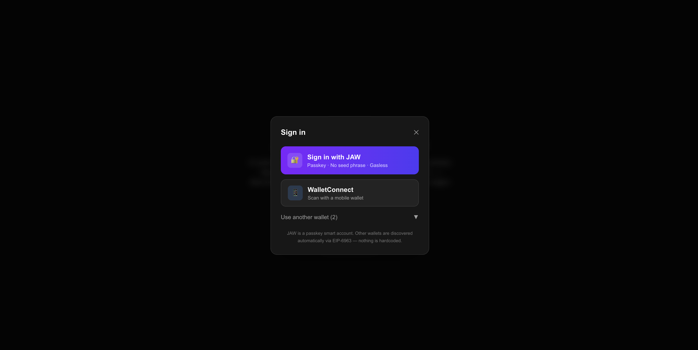
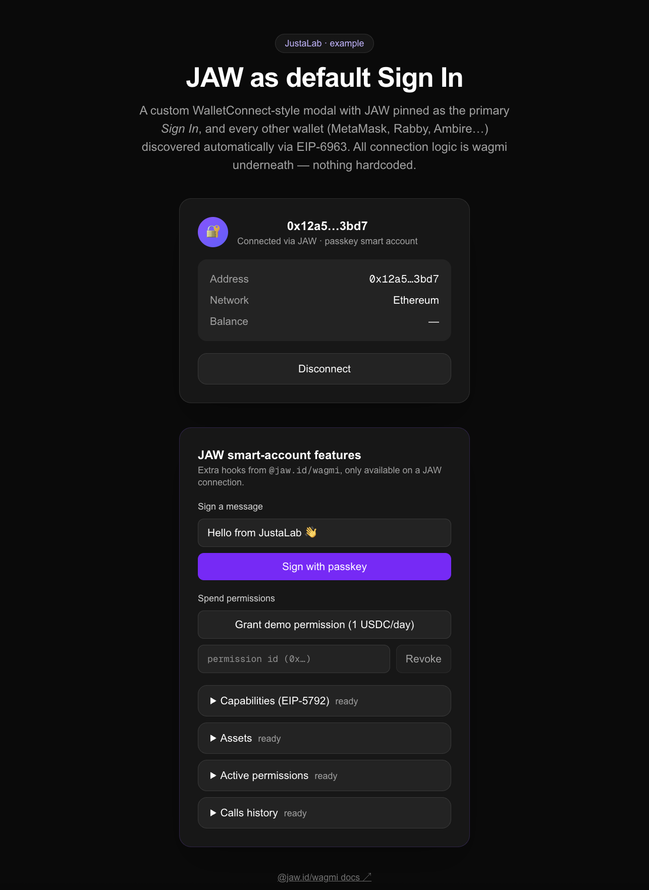

# JustaLab — JAW Sign In example

A minimal Next.js app that demonstrates the recommended way to offer **JAW as
the default "Sign In"** while still letting users pick any other wallet
(MetaMask, Rabby, Ambire…).

| Connect modal | Connected |
| --- | --- |
|  |  |

## The idea

You don't build a wallet modal from scratch and you don't hardcode wallet
buttons. Instead:

1. **JAW is a first-class wagmi connector** via [`@jaw.id/wagmi`](https://www.npmjs.com/package/@jaw.id/wagmi).
   It's a passkey smart account — no seed phrase, gasless, ENS-named.
2. **Every browser-extension wallet is discovered for free** through
   **EIP-6963** (`multiInjectedProviderDiscovery`, on by default in wagmi v2+).
   Installed extensions announce themselves and show up in `useConnectors()`.
3. **Mobile wallets connect over WalletConnect** — the `walletConnect` connector
   (Reown) is registered when a project ID is present and gets its own QR row.
4. The modal **pins JAW to the top**, gives WalletConnect a dedicated row, and
   lists the discovered extensions below. All the connection/error/reconnect
   logic is wagmi underneath.

```ts
const connectors = useConnectors();
const jaw = connectors.find((c) => c.type === "jaw"); // pinned as "Sign In"
const wc = connectors.find((c) => c.type === "walletConnect"); // mobile QR row
const others = connectors.filter(
  (c) => c.type !== "jaw" && c.type !== "walletConnect", // EIP-6963 extensions
);
```

## Run it

```bash
pnpm install
cp .env.local.example .env.local   # add your JAW API key from https://jaw.id
pnpm dev
```

Open http://localhost:3000 (Next picks the next free port if 3000 is taken).
Without an API key the JAW button is shown but sign-in fails; EIP-6963 wallets
still work.

To enable the **WalletConnect** (mobile QR) option, add a project ID from
[Reown Cloud](https://cloud.reown.com) as `NEXT_PUBLIC_WALLETCONNECT_PROJECT_ID`
in `.env.local`. When it's absent the connector is omitted and the modal simply
falls back to JAW + EIP-6963 extensions.

### Environment variables

| Variable | Required | Where to get it |
| --- | --- | --- |
| `NEXT_PUBLIC_JAW_API_KEY` | for JAW sign-in | [jaw.id dashboard](https://jaw.id) |
| `NEXT_PUBLIC_WALLETCONNECT_PROJECT_ID` | for the WalletConnect row | [Reown Cloud](https://cloud.reown.com) |

> Both are **publishable** client keys (they ship to the browser by design), not
> server secrets. `.env.local` is gitignored; `.env.local.example` is the
> committed template — copy it, don't edit it in place.

> **Heads up — `NEXT_PUBLIC_*` is inlined at build time.** In dev (`pnpm dev`)
> the values are read live from `.env.local`. For a production build the
> variables must be present **before** `pnpm build` runs (e.g. set them in your
> Vercel project's Environment Variables) — otherwise the WalletConnect row is
> baked out of the bundle and won't appear, even if you set the var afterwards.

## Architecture

The JAW connector reads `localStorage` during setup, so the wagmi tree can't run
on the server. Rather than gate it behind a `useEffect` (which causes cascading
renders), the app keeps the **static hero server-rendered** and isolates the
wallet UI behind a single `dynamic(ssr: false)` boundary:

```
page.tsx (Server Component) ── hero + API-key banner, SSR'd
└─ <WalletSection/>          ── "use client", dynamic(ssr:false) boundary
   └─ <WalletApp/>           ── WagmiProvider + QueryClient (config built here, client-only)
      └─ <WalletWidget/>     ── connect button / modal / account panel
```

This gives clean SSR for content, no hydration mismatch, and the connector only
ever instantiates in the browser.

## Files

| File | What it does |
| --- | --- |
| `src/lib/wagmi.ts` | wagmi config factory — `jaw()` + optional `walletConnect()` connector + EIP-6963 discovery |
| `src/app/page.tsx` | Server Component: hero, API-key banner |
| `src/components/wallet-section.tsx` | `dynamic(ssr:false)` boundary for the wallet UI |
| `src/components/wallet-app.tsx` | `WagmiProvider` + TanStack Query (config built client-side) |
| `src/components/wallet-widget.tsx` | Connect button ↔ account panel switch |
| `src/components/connect-modal.tsx` | The modal — JAW pinned, WalletConnect row, others collapsible (focus-trapped, ESC, scroll-lock) |
| `src/components/account-panel.tsx` | Connected state (address, ENS, balance, disconnect) |
| `src/components/jaw-features.tsx` | JAW-only smart-account hooks (sign, permissions, assets…) |
| `src/hooks/use-focus-trap.ts` | Reusable focus trap for the modal |

## JAW smart-account features

When connected via JAW, `src/components/jaw-features.tsx` demonstrates the
JAW-specific hooks from `@jaw.id/wagmi` (this section is hidden for MetaMask /
other EIP-6963 wallets):

- **`useSign`** — ERC-7871 `wallet_sign` (personal sign `0x45` / typed data `0x01`)
- **`useGrantPermissions` / `useRevokePermissions`** — ERC-7715 spend & call
  permissions (the demo button grants 1 USDC/day to a placeholder spender)
- **`usePermissions`** — active permissions for the account
- **`useGetAssets`** — token/asset balances (EIP-7811-style)
- **`useCapabilities`** — wallet capabilities (EIP-5792)
- **`useGetCallsHistory`** — past calls/UserOps

And `@jaw.id/ui` offers prebuilt Radix dialogs if you prefer not to roll your
own modal.

## Tests

Component tests run on Vitest + Testing Library (jsdom), with wagmi and the JAW
config mocked so nothing hits a wallet or the network:

```bash
pnpm test        # run once
pnpm test:watch  # watch mode
```

- `connect-modal.test.tsx` — JAW is pinned first, other wallets stay behind the
  toggle, the right connector is passed to `connect()`, the empty state, ESC closes.
- `wallet-widget.test.tsx` — reconnecting placeholder, connect→modal flow, and
  that JAW features show only for JAW connections.

### End-to-end (Playwright)

```bash
pnpm exec playwright install chromium   # once
pnpm test:e2e
```

`e2e/connect.spec.ts` boots a real Next dev server and a Chromium browser to
verify what jsdom can't: the hero is server-rendered, the modal opens with JAW
pinned, EIP-6963 finds no wallets in a headless browser, and the **focus trap**
keeps Tab inside the dialog and restores focus to the trigger on Escape.

## Stack

Next.js 16 · React 19 · wagmi 3 · viem 2 · Tailwind 4 · TypeScript 5.9 · Vitest 4
· Playwright 1.60.

`@tanstack/react-query` is pinned to **`5.100.9`** — the latest release that
still satisfies `@jaw.id/wagmi`'s peer range `>=5.0.0 <5.100.10`. Don't bump it
to 5.101+ until that peer range widens.

> TypeScript 6 and ESLint 10 are held back: `eslint-config-next@16` doesn't
> support them yet.
